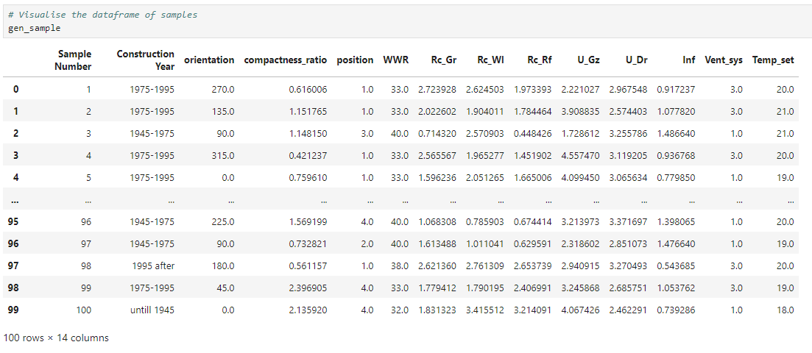
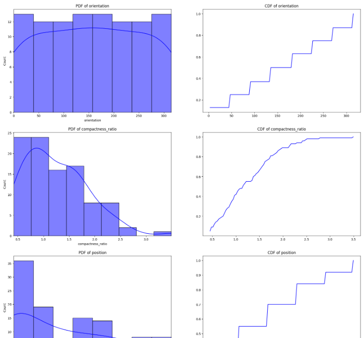

## Instructions for Generating Samples

This folder contains Python scripts and a Jupyter notebook for generating samples for the Apartment dwelling type.

## Contents

1. **Python Script**
   - `Apt_sampler_script.py`: Python script for generating samples.
2. **Jupyter Notebook**
   - `Apt_sampling_notebook.ipynb`: Jupyter notebook that utilizes the Python script to generate samples.

## Dependencies

Before you begin, ensure you have met the following requirements:

**Python Libraries**

- numpy
- seaborn
- pandas
- scipy
- matplotlib
- datetime
- os
- pathlib

## Instructions

These scripts should be used to generate the input files required for parametric simulations. Refer to [3.2_Rhino_grashopper_scripts](https://github.com/pwahi/LTH_readiness_Dutchhomes/tree/main/Apartments/3.2_Rhino_grashopper_scripts) for more details.

### Steps

1. **Open `Apt_sampling_notebook.ipynb` in Jupyter Notebook.**
2. **Provide user input for:**
   - **Iteration number**: Specify the iteration of the experiment you are conducting.
   - **Sample size**: Specify the number of samples you want to generate.

The Jupyter notebook will use the `generate_samples` function from the `Apt_sampler_script.py` file to generate the samples.

```python
# Enter number of iteration 
itr = input("Iteration number: ")
# Enter number of samples
sample_size = int(input("Sample size: "))
# Get today's date
today = datetime.date.today()
# Generate Samples
gen_sample = generate_samples(sample_size)

# Output: 
# Iteration number : 1
# Sample Size : 100
```

You can use `gen_sample` variable to visualise the dataframe of the generated samples.



The distribution of samples can also be visualised along with probability densities (PDF) and cumulative density (CDF).



3. **Saving working sampled data**
   - The generated sampled data can be exported in Excel format. The notebook helps in creating relevant input, output files, and directories required by the [parametric simulation workflow](https://github.com/pwahi/LTH_readiness_Dutchhomes/tree/main/Apartments/3.2_Rhino_grashopper_scripts)