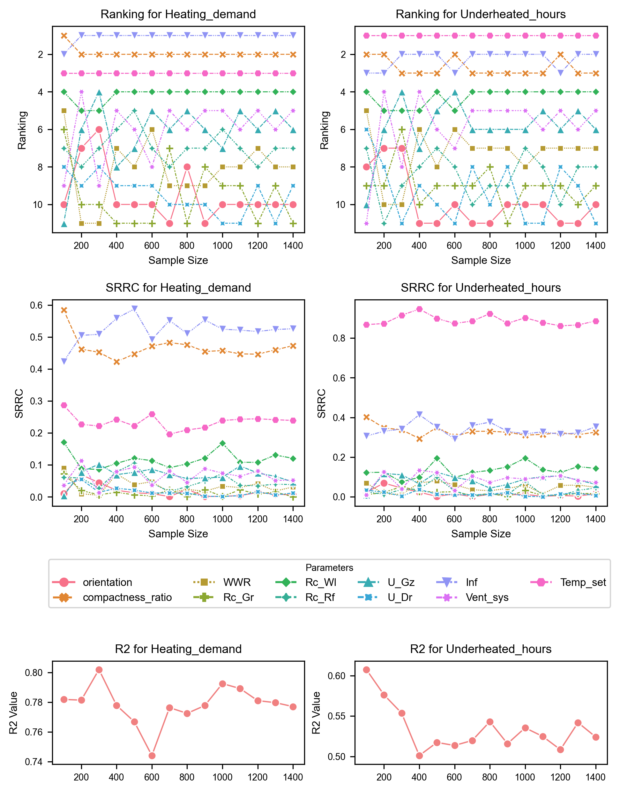
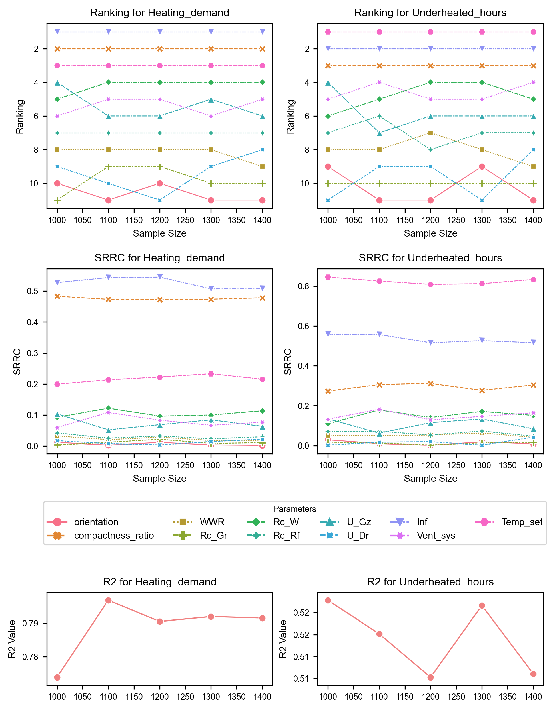

## Instructions for determining sample size

This folder contains Python scripts, a Jupyter notebook, and data used for determining the appropriate sample size 
to represent the variation within the Apartment dwelling type.

## Contents

1. **Python Script**
   - `Sensitivity_SRC_SRRC.py`: Python script for global sensitivity analysis (GSA) using Regression-based methods.
2. **Jupyter Notebook**
   - `Sample_size_analysis.ipynb`: Jupyter notebook that utilises the Python script to analyse iterations of sample size and plot graphs.
3. **Data_Directories**
   - `Data_Med_Temp` : Simulation results for iterations of samples under Medium Temperature supply of 70/50&deg;C. The samples were first generated as described in [3.3.1_Sampling_scripts](https://github.com/pwahi/LTH_readiness_Dutchhomes/tree/main/Apartments/3.3.1_Sampling_scripts) and simulated parametrically as described in [3.2_Rhino_grasshopper_scripts](https://github.com/pwahi/LTH_readiness_Dutchhomes/tree/main/Apartments/3.2_Rhino_grashopper_scripts).
   - `Data_Low_Temp` : Simulation results for iterations of samples under Medium Temperature supply of 55/35&deg;C. The samples were first generated as described in [3.3.1_Sampling_scripts](https://github.com/pwahi/LTH_readiness_Dutchhomes/tree/main/Apartments/3.3.1_Sampling_scripts) and simulated parametrically as described in [3.2_Rhino_grasshopper_scripts](https://github.com/pwahi/LTH_readiness_Dutchhomes/tree/main/Apartments/3.2_Rhino_grashopper_scripts).

## Dependencies

Ensure you have the following Python libraries installed:

- pandas
- numpy
- openturns
- seaborn
- matplotlib
- os
- pathlib

## Instructions

These scripts analyse the simulated outputs from each iteration of sample size. 
The samples were parametrically simulated, and the output are in the Excel format for each iteration of sample size.
The scripts were used to determine the appropriate sample size. The data used in the journal paper can be found in the directories for both Medium and Low Temperature supply. 

These scripts can also be used to conduct sensitivity analysis on any other data. 

### Steps

1. **Open `Sample_size_analysis.ipynb` in Jupyter Notebook.**
2. **Provide user input for:**
   - **suplyT**: Specify the supply temperature you want to analyse (MT or LT)
   - **sens_type**: Specify the sensitivity analysis method (SRRC or SRC)

The Jupyter notebook will use the `sensitivity_analysis` function from the `Sensitivity_SRC_SRRC.py` to conduct the sensitivity analysis using the specified method :
Standardised Regression Coefficient (SRC) or Standardised Rank Regression Coefficient (SRRC). 

```python
# choosing the supply temperature to analyse the data for
suplyT = input("Analyse for (MT/LT): ")

# Specify the global sensitivity analysis method
# if R2 is lower than 0.75 choose SRRC other SRC
sens_type = input("Choose Analysis method (SRRC/SRC): ")

# Output: 
# Analyse for (MT/LT):  LT
# Choose Analysis method (SRRC/SRC):  SRRC
```
The `Sensitivity_SRC_SRRC.py` script has other functionalities that can be explored beyond this study: 
1. `sensitivity_analysis` : Conduct regression-based sensitivity analysis
2. `plot_analysis` : Create a bar plot of sensitivity analysis result. 
3. `bootstrap_analysis` : Perform bootstrap analysis and plot confidence intervals.
4. `calculate_p_values` : Calculate the p-values
5. `calculate_R2` : Calculates the coefficient of determination (R2).

For the Terraced-Intermediate dwelling types, the python script and jupyter notebook was used to analyse the generated and simulated data. 
The jupyter notebook is designed to analyse all iterations of sampling stored in the data directory. 
The figure below shows the analysis of **samples size from 100 to 1400** for Medium Temperature supply.



The figure below illustrates the analysis for **sample sizes from 1000 to 1400** for Low-Temperature supply. 

