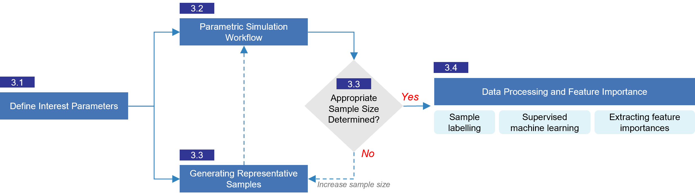

# Parameters affecting Lower Temperature Heating Readiness in Dutch homes : Data and Code

This repository contains the data and code associated with the research paper titled 
"_**Evaluating Building-Level Parameters for Lower-Temperature Heating Readiness: A Sampling-based Approach to Addressing the Heterogeneity of Dutch Housing Stock.**_"
457a8333-5600-4df9-b9f9-694a8db56b92
## Citation
If you use the data or code from this repository, please cite it using the following format:

*Please add the appropriate DataCite citation format here.*

You can access the research artile using this [DOI](https://dx.doi.org/10.2139/ssrn.4854455)

## Folder structure. 
The repository is organised according to the two dwelling types studied: `terraced-intermediate` and `apartment` dwellings.

Each folder of the two dwelling types contains the data and code corresponding to the methodological steps outlined in the research study, as described in the figure below. 

The subfolders are named according to each methodological step.

1. **3.2_Rhino_grasshopper_scripts**: Contains scripts, resources, and instructions for simulating dwelling type samples parametrically for different supply temperatures.
2. **3.3.1_Sampling_scripts**: Includes Python scripts and a Jupyter notebook for generating samples for a specific dwelling type.
3. **3.3.2_Sample_Size_identify_scripts**: Provides Python scripts, a Jupyter notebook, and data used to determine the appropriate sample size to represent variations within the dwelling type.
4. **3.4_Dataprocess_Feature_importances**: Contains a Jupyter notebook and data used for training a Random Forest classifier model and extracting feature importance.
5. **4.5_Radiator_oversizing**: Includes a Jupyter notebook and data used for analysing the effect of radiator oversizing on the readiness of representative samples for `Medium Temperature (70/50°C)` and `Low Temperature (55/35°C)`.

## Acknowledgement
This study was carried out with the support from the MMIP 3&4 scheme of the Dutch Ministry of Economic Affairs & Climate Change and the Ministry of the Interior & Kingdom Relations.

## Licence
The code is licensed under [MIT License](https://opensource.org/license/mit), while data is licensed under [CC by 4.0](https://creativecommons.org/licenses/by/4.0/). Please see the below WAIVER in association with the license.

## WAIVER
Technische Universiteit Delft hereby disclaims all copyright interest in the program “Parameters affecting Lower Temperature Heating Readiness in Dutch homes : Data and Code” written by the Author(s).

Prof.ir. Dick van Gameren, Dean of the Faculty of Architecture and the Built Environment

Copyright (c) 2024 Prateek Wahi, Thaleia Konstantinou, Henk Visscher, Martin J. Tenpierik